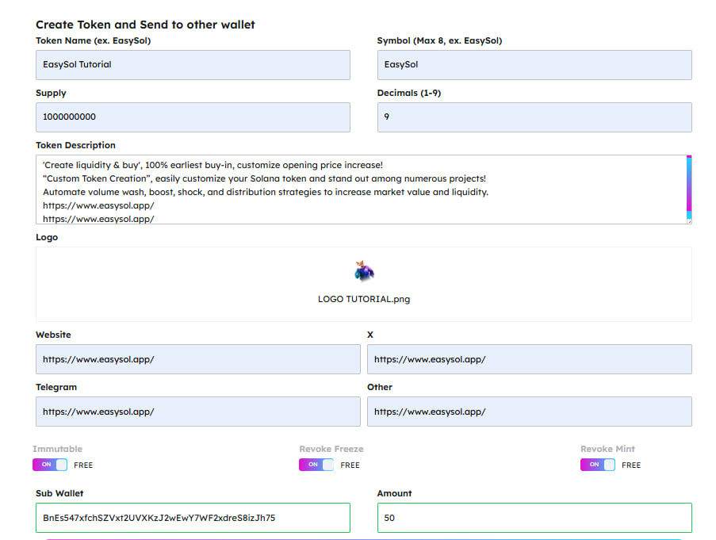
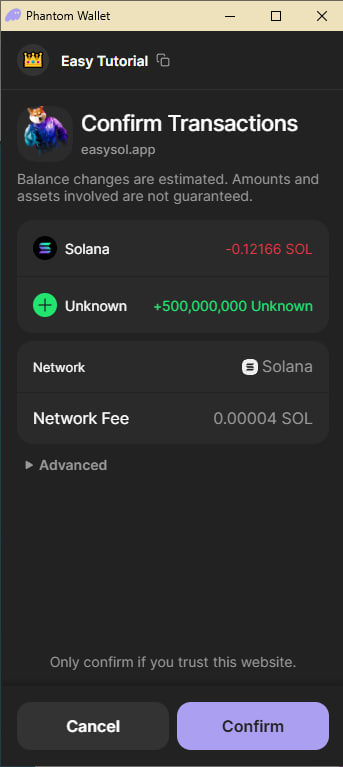
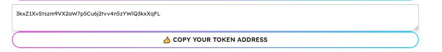
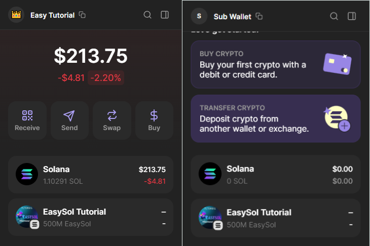

# Create Token and Send To Other Wallet

[https://www.easysol.app/tokendistribution](https://www.easysol.app/tokendistribution)

1. **Connect Your Solana Wallet**

2. **Fill in your token information**
   - Token Name, Decimals, Symbol, Supply, Description, Logo, and socials
   - With 3 options: **Immutable**, **Revoke Freeze**, and **Revoke Mint**. Leave the default **ON** to keep your token "safe".

3. **Fill in the information of the wallet receiving the token and the amount of tokens to send to that wallet (in percentage)**
 _**Example**_
 Sub Wallet: BnEs547xfchSZVxt2UVXKzJ2wEwY7WF2xdreS8izJh75
  Amount: 50 (percents) - equivalent to 500,000,000 token

4. **After completing the information, click on the "CREATE TOKEN" button**

 **It only has 500,000,000 token because it will send 50% (500,000,000 tokens) to the Sub Wallet you specified**
5. **Please wait about 30 seconds to complete the metadata upload and then confirm your wallet to make the transaction.**
   - Then your token address will appear here:

You can copy the token address and use it anywhere you want!

And then the token will appear in your main wallet and sub wallet.

---

## Access Link:
[https://www.easysol.app/tokendistribution](https://www.easysol.app/tokendistribution)
