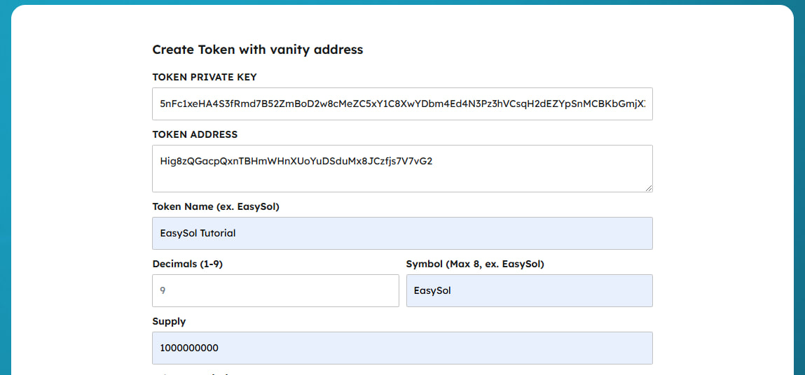
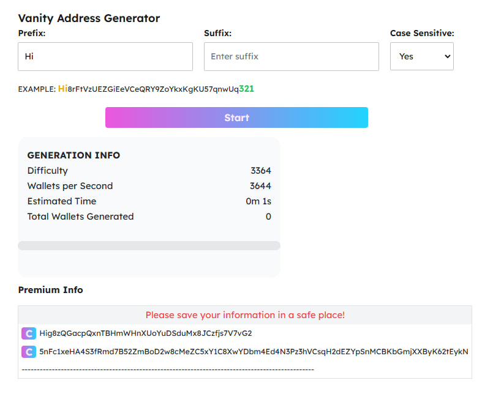
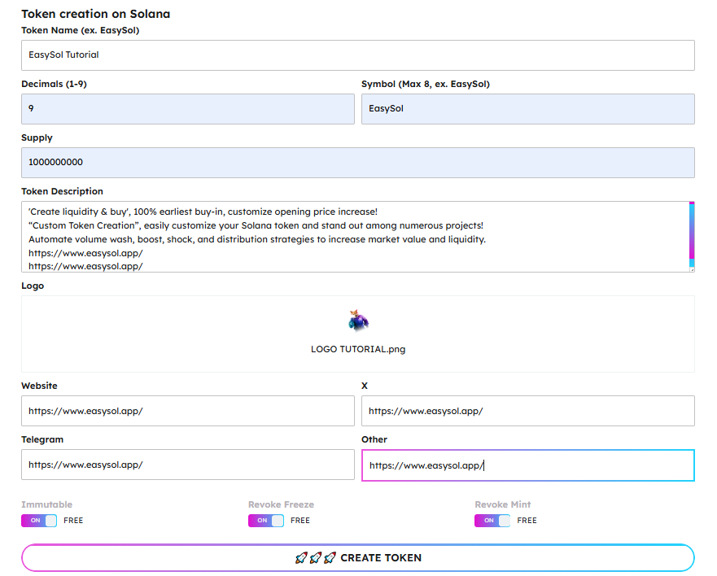
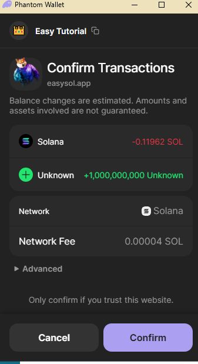
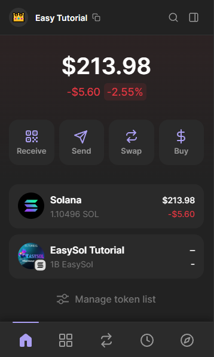

# Create Token With Vanity Address

[https://www.easysol.app/createnametoken](https://www.easysol.app/createnametoken)

1. **Connect Your Solana Wallet**
2. **Enter the custom information of the token**
 Enter the Private Key of the token you want to create a custom name for here and it will automatically display your token name

  **NOTE:** If you don't have a private key for your custom token, you can generate it here: [https://www.easysol.app/vanitywallet](https://www.easysol.app/vanitywallet)

 Example:
- Token Address: Hig8zQGacpQxnTBHmWHnXUoYuDSduMx8JCzfjs7V7vG2
- Token Private Key: 5nFc1xeHA4S3fRmd7B52ZmBoD2w8cMeZC5xY1C8XwYDbm4Ed4N3Pz3hVCsqH2dEZYpSnMCBKbGmjXXByK62tEykN

3. **Fill in your token information**
   - Token Name, Decimals, Symbol, Supply, Description, Logo, and socials
   - With 3 options: **Immutable**, **Revoke Freeze**, and **Revoke Mint**. Leave the default **ON** to keep your token "safe".

4. **After completing the information, click on the "CREATE TOKEN" button**

5. **Please wait about 30 seconds to complete the metadata upload and then confirm your wallet to make the transaction.**

And then the token will appear in your main wallet and sub wallet.

---

## Access Link:
[https://www.easysol.app/createnametoken](https://www.easysol.app/createnametoken)
