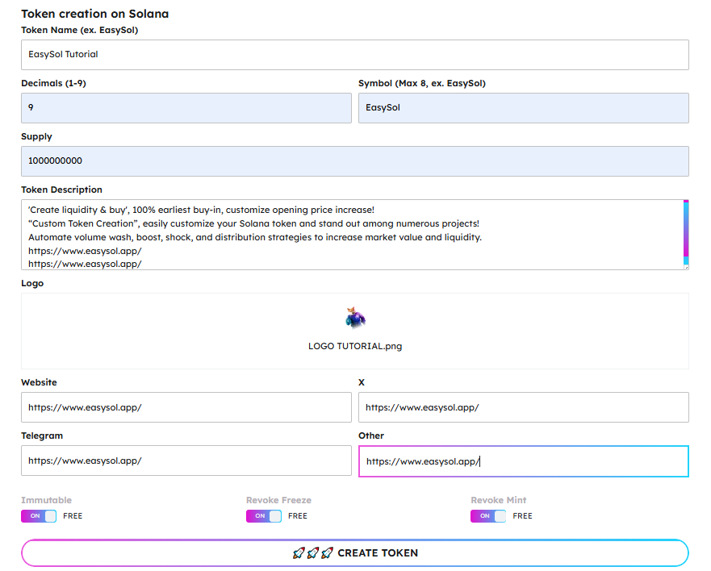
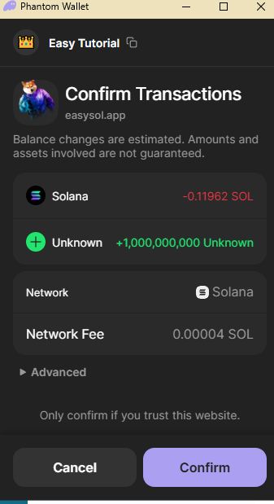
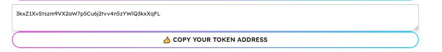
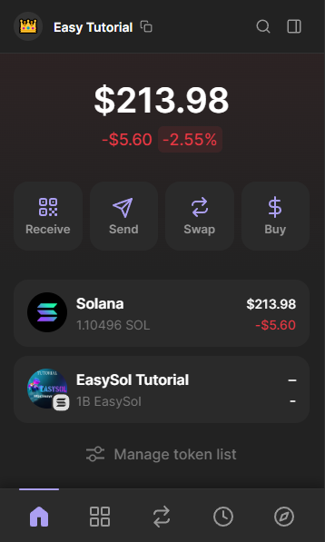

# Normal Token Creator

[https://www.easysol.app/createtoken](https://www.easysol.app/createtoken)

1. **Connect Your Solana Wallet**

2. **Fill in your token information**
   - Token Name, Decimals, Symbol, Supply, Description, Logo, and socials
   - With 3 options: **Immutable**, **Revoke Freeze**, and **Revoke Mint**. Leave the default **ON** to keep your token "safe".

3. **After completing the information, click on the "CREATE TOKEN" button**

4. **Please wait about 30 seconds to complete the metadata upload and then confirm your wallet to make the transaction.**
   - Then your token address will appear here:

You can copy the token address and use it anywhere you want!

And then the token will appear in your wallet.

---

## Access Link:
[https://www.easysol.app/createtoken](https://www.easysol.app/createtoken)
