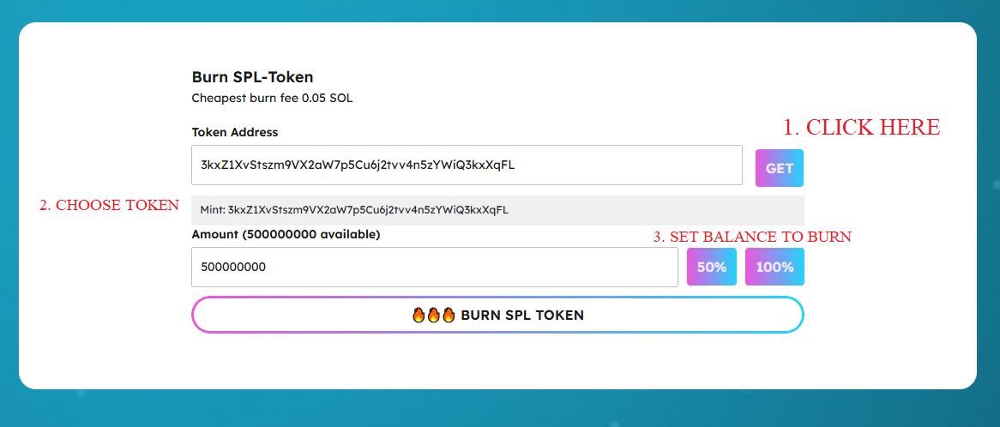
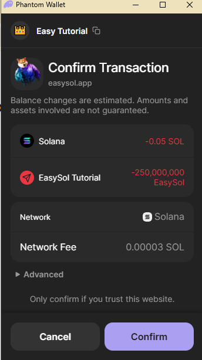
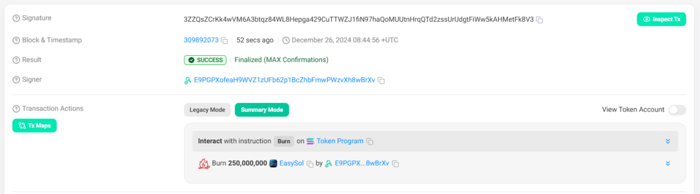

# Burn SPL-Token

[https://www.easysol.app/burntoken](https://www.easysol.app/burntoken)

1. **Connect Your Solana Wallet**

2. **Set necessary parameters**
 After connecting the wallet click the GET button to get the token list and select the token you want to burn from the drop down list
 

3. **After completing the parameter settings, click on the "BURN SPL TOKEN" button**

4. **Please wait a few seconds for the token burn to complete**

---

## Access Link:
[https://www.easysol.app/burntoken](https://www.easysol.app/burntoken)
