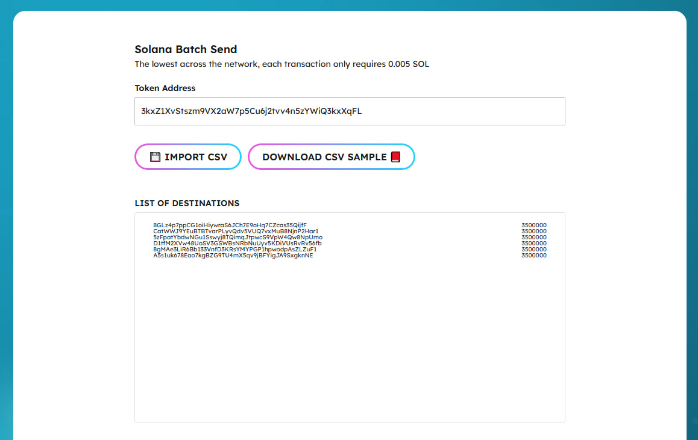
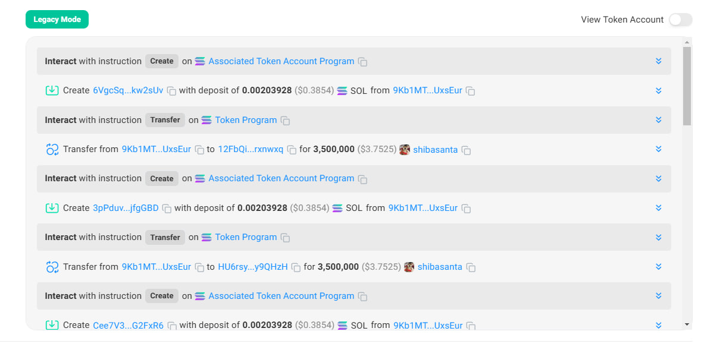

# Solana Batch Send

[https://www.easysol.app/multisender](https://www.easysol.app/multisender)

1. **Connect Your Solana Wallet**

2. **Set necessary parameters**
- Fill in the token address you want to airdrop
- Import an existing file or download a sample file and edit it, then re-import the file.

3. **After completing the parameter settings, click on the "AIRDROP NOW" button**

4. **Please wait a few seconds for the airdrop to complete**

---

## Access Link:
[https://www.easysol.app/multisender](https://www.easysol.app/multisender)
